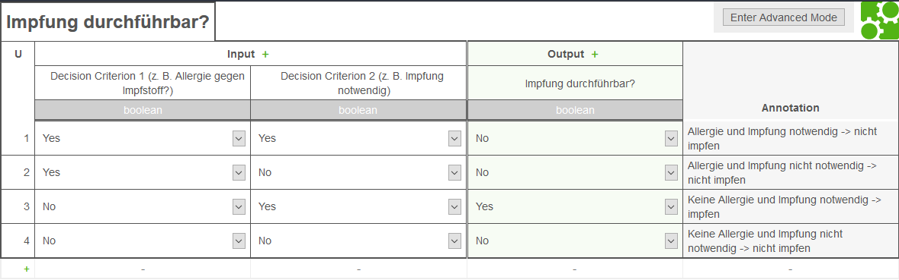

# bpmn-js-clinical-pathways
Dieses Projekt ist ein Modellierungseditor zur Abbildung von Konzepten Klinischer Pfade, die in die abstrakte Syntax des Metamodells der BPMN 2.0 integriert wurden.
Dieser Prototyp entstand während der Masterarbeit mit dem Titel `Konzeption & Implementierung eines webbasierten Modellierungseditors zur Abbildung Klinischer Pfad` von [`FÜSSLIN (2017)`](#literatur).
Die implementierten Konzepte stützen sich weitestgehend auf die Forschungsarbeiten von [`BRAUN ET AL. (2014)`](#literatur), [`BRAUN ET AL. (2015)`](#literatur), [`BRAUN ET AL. (2016)`](#literatur). 
Die vollständigen Literaturverweise können im Abschnitt [Literatur](#literatur) eingesehen werden.

Dabei wurde die JavaScript-Library **bpmn-js** als Ausgangsbasis herangezogen und an notwendigen Stellen erweitert.

## Table of Contents

- [Vorstellung](#vorstellung)
- [Voraussetzungen](#voraussetzungen)
- [Struktur](#struktur)
    - [app](#app)
    - [php](#php)
- [Ausführung](#ausführung)
- [Literatur](#literatur)

## Vorstellung

### Modellierungseditor bpmn-js-clinical-pathways. Quelle: [`FÜSSLIN (2017), S. 49`](#literatur)


### Implementierte Konzepte Klinischer Pfade. Quelle: [`FÜSSLIN (2017), S. 56`](#literatur)


### DMN Beispiel. Quelle: [`FÜSSLIN (2017), S. 62`](#literatur)



## Voraussetzungen
Das Testsystem bestand aus folgenden Komponenten und wurde unter Windows 10 aufgesetzt:
* [Apache 2.4.23 (x64)](https://httpd.apache.org/)
    * inkl. mod_rewrite
* [PHP 7.1.0 (ZTS MSVC14 (Visual C++ 2015) x64)](http://php.net/)
* [NodeJS 7.2.0 & NPM 4.0.5](https://nodejs.org/)

Die Anwendung wurde mit Mozilla Firefox und Google Chrome getestet.

**!Wichtig!**

Die Pfade der Programme `node`, `npm` und `php` müssen in der Windows PATH-Variable vorhanden sein, um Befehle über die Kommandozeile ausführen zu können.
Zum Beispiel:

Benutzervariable [PATH] für ###USERNAME###:
`C:\Users\###USERNAME###\scoop\apps\nodejs\7.2.0\nodejs`
 <br>
 Systemvariable [PATH]:
`C:\Users\###USERNAME###\scoop\apps\php\current`

(PHP unter Systemvariablen anlegen, da der WebServer meistens unter einem anderen User ausgeführt wird und daher die Systemvariablen des Nutzers ###USERNAME### keine Gültigkeit besitzen.) Die korrekte funktionsweise kann in der Kommandozeile z. B. via `node -v`, `npm -v` bzw. `php -v`überprüft werden. 

**Konfiguration des WebServers**

Der Webserver muss so konfiguriert werden, dass der Document-Root auf das Verzeichnis `php/public` zeigt. 

## Struktur
### app
Dieser Ordner beinhaltet alle Quelldateien, um die bpmn-js erweitert wurde. Bpmn-js wurde nicht-destruktiv erweitert. Damit ist gemeint, dass die Quelldateien nicht modifiziert worden sind und die Library weiterhin gekapselt ist.
Das hat den Vorteil, dass bpmn-js unabhängig von diesem Projekt aktualisiert werden kann, um so von neuen Features und Bug-Fixes zu profitieren.
In der separaten [README](app) im Ordner **./app** wird auf weitere Details eingegangen.

### php
In diesem Verzeichnis befindet sich das Server-Backend auf Basis des Zend Framework 3. 
Eine Erläuterung der einzelnen Inhalte kann in der separaten [README](php) im Ordner **./php** gefunden werden.

Für weitere Informationen zur Funktionsweise und Struktur des Zend Framework 3 sei auf dessen [Dokumentation](https://framework.zend.com/learn) verwiesen.

## Ausführung
Im Folgenden wird erklärt, wie das Projekt in einer lokalen Testumgebung ausgeführt werden kann.

### Abhängigkeiten installieren (einmalig ausführen)
 ```
 npm install
 ```
 
 ### Abhängigkeiten des PHP-Moduls installieren (einmalig ausführen)
 **HINWEIS**: PHP muss dazu in der PATH-Variable sein und über die Kommandozeile z. B. per `php -v` erreichbar sein.
  ```
  npm run php-dependencies
  ```
  
### Ausführen des Projektes (ohne PHP Funktionalitäten)
 Der Befehl
 ```
 grunt auto-build
 ```
 kopiert alle notwendigen Dateien in den **"dist"** Ordner, führt den integrierten WebServer **Karma** aus und lädt das Projekt im Browser
 unter [http://localhost:9013](http://localhost:9013).
 
 ### Produktiv-Version erzeugen (inkl. PHP Funktionalitäten)
 Der Befehl
 ```
 grunt php-release
 ```
 kopiert alle notwendigen Dateien in den Ordner **php/public/cp-modeler** und stellt diese für die Verwendung innerhalb des integrierten Zend Framework 3 bereit.
 
## Literatur
[BRAUN ET AL. 2014] BRAUN, Richard ; SCHLIETER, Hannes ; BURWITZ, Martin ; ESSWEIN,
Werner: _Bpmn4cp: Design and implementation of a bpmn extension for clinical pathways._
In: Bioinformatics and Biomedicine (BIBM), 2014 IEEE International Conference on IEEE,
2014, S. 9–16

[BRAUN ET AL. 2015] BRAUN, R. ; BURWITZ, M. ; SCHLIETER, H. ; BENEDICT, M.: _Clinical
processes from various angles - amplifying BPMN for integrated hospital management._ In:
2015 IEEE International Conference on Bioinformatics and Biomedicine (BIBM), 2015, S.
837–845

[BRAUN ET AL. 2016] BRAUN, Richard ; SCHLIETER, Hannes ; BURWITZ, Martin ; ESSWEIN,
Werner: _BPMN4CP Revised – Extending BPMN for Multi-perspective Modeling of Clinical
Pathways._ In: Hawaii International Conference on System Sciences (HICSS) 49 (2016), S.
3249–3258. – DOI [http://doi.ieeecomputersociety.org/10.1109/HICSS.2016.407](http://doi.ieeecomputersociety.org/10.1109/HICSS.2016.407). – ISSN 1530–1605

[FÜSSLIN 2017] FÜSSLIN, Maximilian: _Konzeption & Implementierung eines webbasierten Modellierungseditors zur Abbildung Klinischer Pfade._ 2017. Technische Universität Dresden