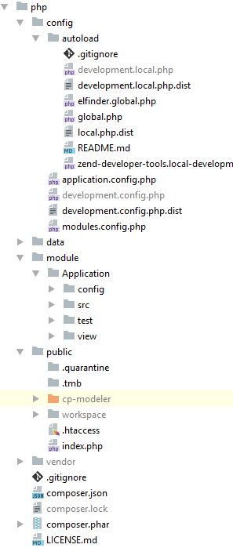

# Struktur der PHP-Komponente

##### config/autoload/elFinder.global.php
 Diese Datei enthält die Konfiguration für das Dateibrowser-Modul **"ElFinder"**.
##### module/Application
 Das Application Modul. In diesem Modul befinden sich Controller und Views zur Anzeige und Konfiguration des Modellierungseditors und der Dateibrowserfunktionalität von **"ElFinder"**.
##### module/Application/module.config.php
 Diese Datei beinhaltet die Konfiguration des Moduls Application. Darin enthalten sind z. B. die Konfiguration des Routers, der festlegt, welche URLs von welchem Controller verarbeitet werden.
##### module/Application/src/Application/Controller
 Hier befinden sich die Controller, die für die Verarbeitung bestimmter URLs angelegt worden sind und passende Views bzw. JSON-Daten zurückliefern.
##### module/Application/view/layout/layout.phtml
 Diese Datei stellt das Grundgerüst des HTML-Layouts zur Verfügung.
##### module/Application/view/application/index
 In diesem Ordner befinden sich Views. **"index.phtml"** ist für die Anzeige des BPMN-Modellierungseditors zuständig, **"index-dmn"** für die Darstellung des DMN-Modellierungseditors.
##### public/cp-modeler
 In diesen Ordner werden beim Deployment-Prozess durch **"grunt"** alle für die Ausführung des Modellierungseditors notwendigen Dateien kopiert.
 
 **AUSNAHME: app/index.html** und **app/dmn/index.html!** Ergeben sich Änderungen im Projekt an diesen Dateien, müssen diese Änderungen momentan manuell
in den View-Scripts **"module/Application/view/application/index/index.phtml"** sowie **"module/Application/view/application/index/index-dmn.phtml"** nachgezogen werden!
Neue Scripts/Stylesheets, die in den Header geladen werden müssen, können auch in **module/Application/view/layout.phtml** angepasst werden.
##### public/workspace
 Hier befindet sich der workspace, in dem Dateien gespeichert und geladen werden können vom integrierten Dateibrowser **"ElFinder"**.
##### composer.json
 In dieser Datei werden die Abhängigkeiten des Zend Frameworks 3 vorgehalten.